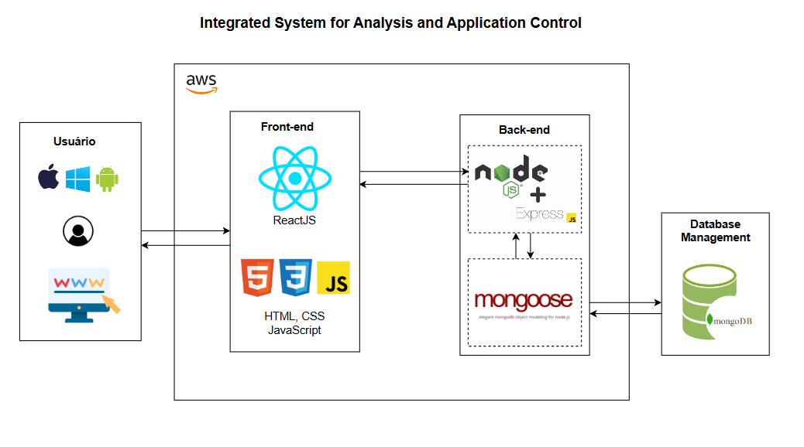

# Arquitetura da Solução

## Desenho da Arquitetura

A arquitetura da solução ISAAC foi cuidadosamente planejada para garantir eficiência, segurança e escalabilidade. Cada componente desempenha um papel crucial para proporcionar uma melhor experiência para o usuário e garantir que todas as operações sejam executadas de forma eficaz.

### Descrição do Desenho
- **Cliente (Frontend)**: Desenvolvido em React.js, pois permite a criação de componentes reutilizáveis e oferece uma experiência de usuário rápida e responsiva. Ele se comunica com o backend via HTTP.
- **Servidor (Backend)**: Desenvolvido em Node.js com Express, que gerencia a lógica de negócios e a comunicação com o banco de dados. Node.js é uma plataforma eficiente para construir aplicações de rede escaláveis, e o Express é um framework minimalista e flexível, ideal para construir APIs robustas.
- **Banco de Dados (MongoDB)**: Utilizado para armazenar dados das sessões de terapia, programas de ensino, usuários, etc. MongoDB oferece flexibilidade e escalabilidade para dados não estruturados, permitindo consultas rápidas e eficientes.
- **Autenticação (JWT)**: Garante a segurança das comunicações entre cliente e servidor usando JWT, uma forma segura e compacta de transmitir informações como um objeto JSON, amplamente utilizado para autenticação e troca de informações seguras.
- **Hospedagem (AWS)**: AWS é a plataforma de deploy escolhida pelos seguintes motivos:
  - **Escalabilidade**: Oferece infraestrutura altamente escalável para acompanhar a demanda.
  - **Confiabilidade**: Alta disponibilidade garantida.
  - **Segurança**: Proteção robusta dos dados.
  - **Serviços Integrados**: Ampla gama de serviços que facilitam desenvolvimento e manutenção.

## Infraestrutura
- **Servidores em nuvem**: A AWS é utilizada para hospedagem, garantindo escalabilidade conforme a demanda, alta disponibilidade e confiabilidade. Além disso, a AWS oferece serviços integrados que facilitam tanto o desenvolvimento quanto a manutenção da aplicação.
- **Armazenamento seguro**: Implementação de criptografia dos dados em trânsito e em repouso para garantir a segurança e conformidade com regulamentações de privacidade.

## Monitoramento e Manutenção
- **Ferramentas de monitoramento**: Implementação de ferramentas como Prometheus e Grafana para monitoramento contínuo da saúde e desempenho da aplicação.
- **Sistema de backup**: Rotinas de backup automatizadas para garantir a recuperação dos dados em caso de falhas.

## Diagrama

[Voltar](index.md)
